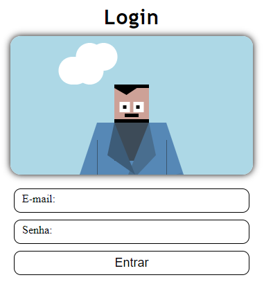
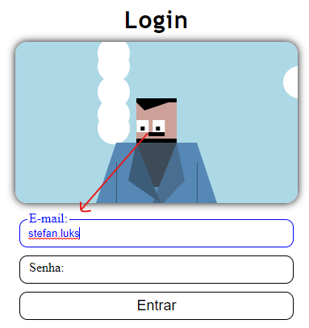
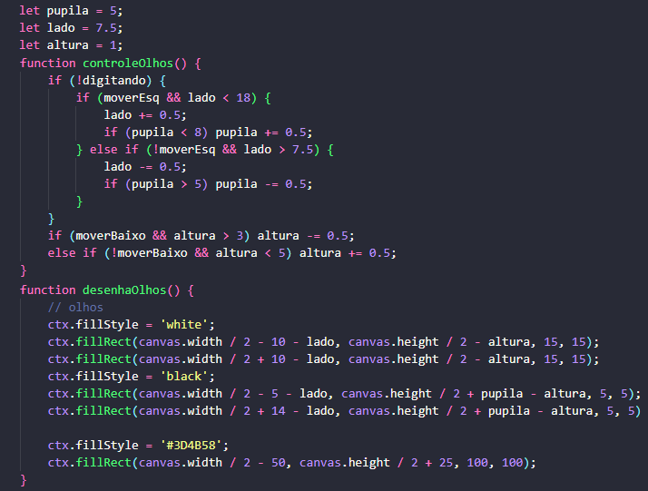

# Form Animated
### Animated form with javascript, character interacts with user inputs.

> ### Acess: https://stefanluks.github.io/FormAnimated/
 
Using canvas to draw the character, and animating according to the amount of letters in the input.
The "eyescontrol" function is called every frame, updating the eye position by changing the variables.
so the "drawEyes" function is called updating the drawing on the canvas.

### Visualization:
 

 
### Code example:

 